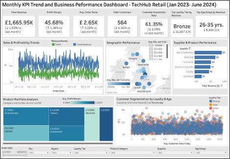

# Business-Intelligence-Dashboard-TechHub-Retail

**📊 TechHub Retail – Executive Sales & Profitability Dashboard**

**🔎 Project Overview**

This project presents an executive-level Business Intelligence dashboard built in Tableau Public for TechHub Retail, a UK-based online electronics retailer.

The objective was to integrate multi-source data (Sales, Customers, Products) and generate actionable insights to support 2025 strategic planning.

⸻

**Live Dashboard**

👉 View the interactive Tableau Dashboard here:

[TechHub Retail Dashboard – Tableau Public](https://public.tableau.com/views/BusinessIntelligenceDashboardforTechHubRetail_17707664500250/Executivedashboard?:language=en-US&:sid=&:redirect=auth&:display_count=n&:origin=viz_share_link)

**📊 Dashboard Preview**

⸻

**🎯 Project Aim**

	•	Identify growth opportunities across products, regions, and customer segments
	•	Analyse seasonal patterns and performance trends
	•	Evaluate profitability drivers and supplier performance
	•	Generate data-driven strategic recommendations for executive decision-making

⸻

**🗂️ Datasets Used**

	•	Sales Dataset (18 months, 12,000+ transactions)
	•	Customer Dataset (3,500+ unique customers)
	•	Product Dataset (300+ products with cost and launch data)

Datasets were integrated using Tableau relationships via:

	•	customer_id
	•	product_id

⸻

**📈 Key Analysis Areas**

	•	Revenue & Profitability Trends (Monthly & Quarterly)
	•	Profit Margin by Product Category & Supplier
	•	Geographic Performance (Region & City level)
	•	Customer Segmentation (Age, Loyalty Tier, Acquisition Channel)
	•	Customer Lifetime Value & Tenure Analysis
	•	Product Lifecycle (Product Age vs Sales Performance)

⸻

**🔍 Key Findings**

	•	Strong seasonality: Revenue peaks in Q4 and early Q1, with consistent mid-year slowdowns.
	•	High-margin categories: Networking and Tablets outperform others in profitability.
	•	Supplier impact: ByteWare and Quantum Supplies combine strong margins with stable revenue.
	•	Customer insights: Revenue is driven by new customers and Bronze tier, while 26–35 age group dominates volume.
	•	Product lifecycle effect: Mid-life products (2–4 years since launch) generate highest revenue.

⸻

**🚀 Strategic Recommendations**

	1.	Prioritize margin-led growth by expanding high-margin categories and optimizing lower-margin segments.
	2.	Align marketing and inventory with seasonal demand patterns to maximize Q1–Q2 peaks.
	3.	Shift from acquisition-heavy growth toward retention and loyalty-tier upgrades to improve long-term profitability.

⸻

**💡 Real-World Impact**

This dashboard enables executives to:

	•	Make data-driven budgeting and inventory decisions
	•	Optimize supplier partnerships
	•	Improve customer retention strategies
	•	Plan seasonal campaigns with measurable impact
	•	Strengthen 2025 growth forecasting and strategic planning

⸻

**🛠️ Tools & Skills Demonstrated**

	•	Tableau Public (Dashboard Design & Interactive Filters)
	•	Data Modeling & Relationships
	•	KPI Design & MoM/QoQ Analysis
	•	Profit Margin & CLV Calculations
	•	Trend & Seasonality Analysis
	•	Business Insight Development
	•	Executive Reporting

⸻

**🔗 Deliverables**

	•	Interactive Tableau Public Dashboard
	•	Executive PDF Report (≤1500 words)
	•	Data-driven strategic recommendations
